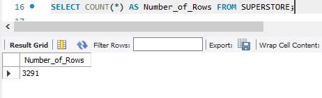
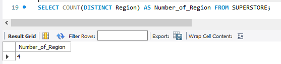
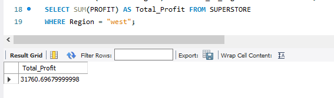
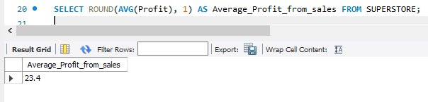
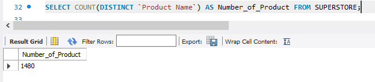

### Functions,Sorting And Aggreagations in MySQL
## **Introduction**
- Aggregate functions in SQL are used to perform calcculations on sets of values are return a single result.These functions are often applied to columns in a database table to summarize data.commonly used aggregate functions in SQL include,SUM,COUNT,AVG,MIN,MAX
## **Problem Statement**
With the Superstores Data set,the following problems is to be solved
- How many rows are in the SALES table provided?
- The business is operating in how many REGIONS?
- What is the Total Profit generated in the WEST region?
- What is the Average Profit generated from the sales of the company's Product?
- On average,how many days does it take for a customer to get their orders shipped? create a new column(days_to_ship)
- How many Products does the company sell?
- Show the Names and Cities of the 5 customers who contributed most to the overall Profit
- Show the sales generated by Cities where the Total sales is greater than 20000
- ### Result/Discussions
# To get the number of rows in the SALES table provided,
- The Sql function as seen in the snipshot below is used,which gives 3,291 Rows in the Sales table
- 
- --

# To get how many "Regions" the business is operating in,
- The sql function/syntax as seen in the snipshot below is used, which gives 4 (four) regions
- 
- --

# To get the total profit generated in the WEST region,
- The SQL function/syntax as seen in the snipshot below is used,which gives 31760.69679999998 as the "Total Profit"
- 
- --

# To get the average profit from the sales of the company's product,
The SQL function/syntax as seen in the snipshot below is used,which when approximated to 1(one) decimal point,gives 23.4 as the "Average Profit from Sales"
- 
- --
# To get on average,how many days it takes for a customer to get their orders shipped,
- The SQL Function/is used,
- 
